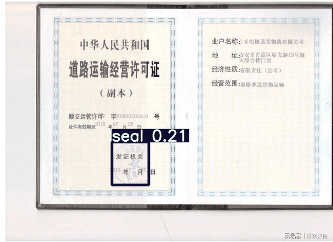

# 目标检测半监督学习模型构建完成，实验效果比较好，只需要1张训练集，就可以在发票印章检测上达到0.952的mAP，模型采用yolov3-backbone和FixMatch策略  
## 效果演示：

## data：
    ./data/ocr_table/semi下的目录结构
            ├── images
        │   ├── test
        │   ├── train
        │   ├── train.bak
        │   └── val
        ├── labels
        │   ├── test
        │   ├── train
        │   ├── train.bak
        │   ├── train.cache
        │   ├── val
        │   └── val.cache
        ├── label_unlabel_gen.py
        ├── un_images
        │   └── train
        └── un_labels
            └── train
    有标签目录：images、labels；
    无标签目录：un_images、un_labels  
## 训练：
```bash
准备：
去ultralytics实现的yolov3直接下载yolov3.pt：https://github.com/ultralytics/yolov3

训练顺序：
step_1：
$ python train_semi.py --train_type SL
step_2：
$ python train_semi.py --train_type SSL
```
## 结果：
    1张带label的训练集:
        SL训练结果：
        P           R           mAP@.5      mAP@.5:.95
        0.901       0.59        0.728       0.57    
        SSL第一次训练结果（1张带label的训练集+600张不带label的数据集）：
        P           R           mAP@.5      mAP@.5:.95
        0.967       0.843       0.898       0.75
        SSL第一次训练结果（1张带label的训练集+600张不带label的数据集）：
        P           R           mAP@.5      mAP@.5:.95
        0.905       0.916        0.92       0.792
    
    31张带label的训练集:
        SL训练结果：
        P           R           mAP@.5      mAP@.5:.95
        0.938       0.914       0.922       0.871
        P           R           mAP@.5      mAP@.5:.95
        0.952       0.952       0.954       0.882
## 建议：
1. 训练完成后建议使用last.pt，因为这个最后模型稳定后的输出模型，模型训练稳定可以把--update_unlabel_conf从0.7调成0.4。  
2. 可以循环多次训练，也就是SL→SSL→SSL→……，但是在进行第二次SSL的时候记得需要把
--weights='./runs/semi/exp/weights/last.pt'修改为
--weights='./runs/semi/exp2/weights/last.pt'，以此类推第三次需要改为
--weights='./runs/semi/exp3/weights/last.pt'。  
3. 循环多次训练一定要保证是正向促进，要不然训练会跑偏。
4. 要多关注un_images生成的label，如果发现label大批错误要及时修正模型。
